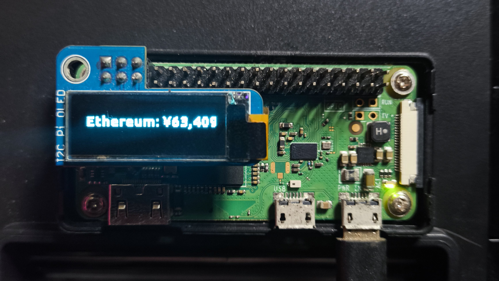

Monetachi

Monetachi is a Raspberry Pi project that displays your local IP and crypto wallet balances on a small OLED display (128x32 / 128x64). Text appears with a fade-in/fade-out effect. Wallet data is fetched from the CoinGecko API and blockchain APIs.

---

Features

Show Raspberry Pi IP address

Display individual token balances and total net worth

Fade-in/fade-out text animation

Support multiple currencies (USD, JPY, IDR, EUR)

Full wallet configuration via config.toml (offline tokens + public addresses)

Auto-update wallet data at configurable intervals

Supports multiple blockchain networks (TRON ready, others coming)

---

Hardware Requirements

Raspberry Pi Zero W (or any Pi with I²C)

SSD1306 OLED display (128x32 or 128x64)

I²C interface enabled

Optional: TTF font file (default: ubuntu.ttf)

---

Quick Setup

1. Enable I²C on Raspberry Pi

sudo raspi-config

Go to: Interfacing Options → I2C → Enable → Reboot

2. Install dependencies

sudo apt update
sudo apt install -y python3-pip python3-smbus i2c-tools
pip3 install adafruit-circuitpython-ssd1306 pillow requests toml base58

3. Check I²C connection

sudo i2cdetect -y 1

OLED should appear at 0x3C or 0x3D.

4. Font

Place ubuntu.ttf (or another TTF) in your project folder. Adjust the path in monetachi.py if needed.

---

Configuration (config.toml)

All wallet data is managed via config.toml. Example:

# Public wallets (read-only)
[[wallet]]
chain = "tron"
addr = "TKntoronolEXAMPLE"

[[wallet]]
chain = "solana"
addr = "BddVgqRdRxQvHu8bEgNTu7NcaeUEEXAMPLE"

# Offline/manual tokens
[walletOffline]  # token_id must match CoinGecko API naming
dogecoin = 50
tether = 50
shiba-inu = 1000
usd-coin = 200
ethereum = 1.5

# API keys for blockchain services
[apikey]
trongrid = "622999XX-2bae-460e-956a-b5EXAMPLE"

[[wallet]]: add any public blockchain address. Currently TRON supported, others in progress.

[walletOffline]: manual tokens with balances for display.

[apikey]: API keys for blockchain services (if required).

No code modification needed—everything comes from config.toml.

---

Example Output (wallet_info())

If you run print(wallet_info()) with the above config, you might get:

['Tron: ¥123,456',
 'Doge: ¥2,500',
 'Shiba: ¥1,200',
 'Tether: ¥3,400',
 'Usd-coin: ¥6,700',
 'Ethereum: ¥45,000',
 'Net: ¥182,256']

Each line shows token name and value in default currency (JPY)

Net shows the total wallet value

---

Update Interval

Set update frequency (seconds) in the main loop of monetachi.py:

if time.time() - last_fetch > 3600:  # 1 hour
    wallet_lines = wallet_info()
    last_fetch = time.time()

---

Running

python3 monetachi.py

OLED displays IP and wallet info continuously

Wallet data updates automatically at the configured interval

Fade effect simulated for monochrome displays

Run in Background / Startup

nohup python3 /home/pi/monetachi.py > /dev/null 2>&1 &

Or via crontab:

crontab -e
@reboot nohup python3 /home/pi/monetachi.py > /dev/null 2>&1 &

---

Supported Blockchains (Status)

✅ TRON (via TronGrid, full support)

⚠️ Solana (under construction)

⚠️ Ethereum, BSC, Polygon, etc. (planned)

---

API & Credits

Wallet data fetched from:

CoinGecko API

TronGrid (TRON)

Contributions welcome! Feel free to open a pull request ❤️

---
