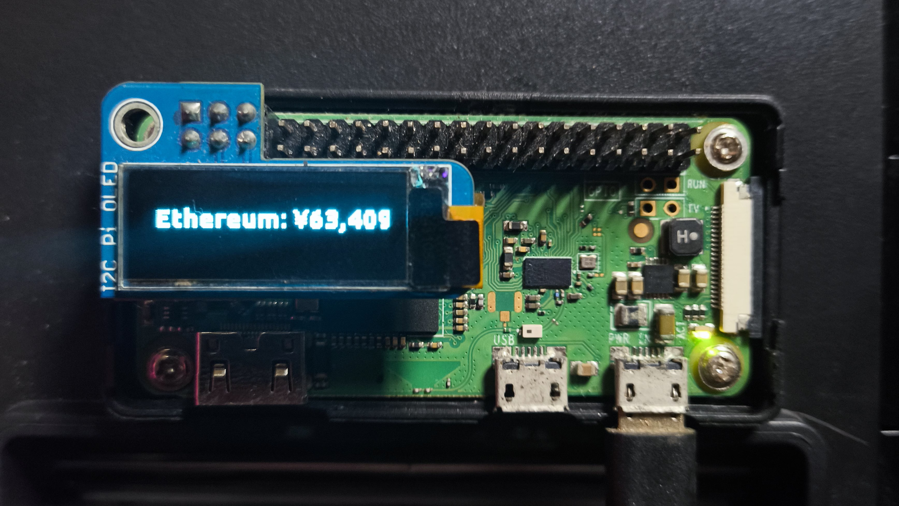

# Monetachi

Monetachi is a Raspberry Pi project that shows your **local IP** and **crypto wallet values** on a small OLED display (128x32 / 128x64). Text appears with a fade-in/fade-out effect. Wallet data is fetched from the [CoinGecko API](https://www.coingecko.com/en/api).

---

## Features

- Display Pi IP and wallet assets
- Individual token values + total net worth
- Fade-in/fade-out text effect
- Customizable tokens, amounts, and display names
- Configurable update intervals (default: 1 hour)
- Supports multiple currencies: USD, JPY, IDR, EUR

---

## Hardware

- Raspberry Pi Zero W (or any Pi with I²C)
- OLED SSD1306 (128x32 or 128x64)
- I²C interface enabled

---

## Quick Setup

1. **Enable I²C**
```bash
sudo raspi-config
```
Interfacing Options → I2C → Enable → Reboot


2. Install dependencies

```bash
sudo apt update
sudo apt install -y python3-pip python3-smbus i2c-tools
pip3 install adafruit-circuitpython-ssd1306 pillow requests
```

3. Check I²C
   
```bash
sudo i2cdetect -y 1
```
OLED should appear at 0x3C or 0x3D

4. Font

Make sure ubuntu.ttf (or another TTF) is available. Adjust path in code if needed.

---

Customization

Tokens

Modify `wallet_info()` to add/remove tokens:
```python
tokens = [
    ("shiba-inu", 1000),
    ("dogecoin", 5),
    ("tehter", 10)
]
```

Format: (token_id, amount)
token_id must match CoinGecko API naming.


Custom Names

Inside `token_value()`, override display names:
```python
if token_id.upper() == "SHIBA-INU":
    token_id = "shiba"
```
Update Interval

Set update frequency (seconds) in main loop:
```python
if time.time() - last_fetch > 3600:  # 1 hour
    wallet_lines = wallet_info()
    last_fetch = time.time()
```
Currency Display

Default currency is jpy, change default_currency in `wallet_info()` if needed.


---

Make sure your Raspberry Pi is connected to the internet before running.

```bash
python3 monetachi.py
```

- OLED displays IP and wallet info continuously  
- Wallet data updates automatically at the configured interval  
- Fade effect simulated for monochrome displays  

---

Run in Background or on Startup

nohup:
```bash
nohup python3 /home/pi/monetachi.py > /dev/null 2>&1 &
```

crontab:
```bash
crontab -e
# add this line:
@reboot nohup python3 /home/pi/monetachi.py > /dev/null 2>&1 &
```

---

## API & Credits | Contribution


Wallet data is fetched from the [CoinGecko API](https://www.coingecko.com/en/api). Thanks to CoinGecko for providing free crypto price data.

Contributions are very welcome! Feel free to open a pull request ❤️

---
